# Linux 
* As habilidades do Linux são necessárias para muitas faixas profissionais de TI. Por exemplo, o conhecimento de comandos básicos do Linux é um pré-requisito para programas de certificação de TI

## Comandos
Os comandos são sensitive case, ou seja, há distinção entre letras maiúsculas e minúsculas.

A maioria dos comandos segue um padrão simples de sintaxe:

` comando [opcoes…] [argumentos…] `

Em outras palavras, você digita um comando, seguido de quaisquer opções e/ou argumentos antes de pressionar a tecla Enter. Normalmente, as opções alteram o comportamento do comando e os argumentos são itens ou valores para o comando agir.

* O comando ` pwd ` pode ser usado para mostras sua localização atual dentro de um sistema de arquivos.
* O comando ` ls ` é usado para listar o conteúdo de um diretório.
* O comado ` cd ` é usado para navegar e alterar entre diretórios.
* O comando ` su ` permite que você atue temporariamente como um usuário administrador.
* O comando ` sudo ` permite que você execute um comando como usuário administrador sem criar um novo shell.
* O comando ` chmod ` é usado para alterar as permissões de um arquivo ou diretório.
* O comando ` chown ` é usado para alterar a propriedade de arquivos e diretórios.
* O comando ` cat ` exibirá todo o conteúdo de um arquivo.
* O comando ` head ` filtra as linhas de saída e visualização da parte superior de um arquivo.
* O comando ` tail ` filtra as linhas de saída e visualização da parte inferior de um arquivo.
* O comando ` cp ` é usado para copiar arquivos.
* O comando ` dd ` é um utilitário para copiar arquivos ou partições inteiras no nível de bits.
* O comando ` mv ` é usado para mover um arquivo de um local no sistema de arquivos para outro.
* O comando ` rm ` é usado para excluir arquivos e diretórios.
* O comando ` grep ` é um filtro de texto que irá procurar linhas de entrada e retorno que contenham uma correspondência para um determinado padrão.
* O comando ` shutdown ` faz com que o sistema seja desligado de forma segura.
* O comando ` ifconfig ` significa “configuração de interface” e é usado para exibir informações sobre a configuração de rede.
* O comando ` ping ` é usado para verificar a conectividade entre dois computadores.
* O comando ` ps ` pode ser usado para listar processos.
* O comando ` dpkg ` é usado para gerenciar pacotes do sistema.
* O comando ` apt-get update ` mostra uma lista de pacotes disponíveis que estão atualizados.
* O comando ` apt-cache search ` procura palavras chaves dentro dos pacotes.
* O comando ` apt-get install ` é usado para instalar um pacote.
* O comando ` apt-get update ` atualiza o cache de todos os pacotes.
* O comando ` apt-get upgrade ` autaliza todos os pacotes e dependências.
* O comando ` apt-get remove ` remove um pacote.
* O comando ` apt-get purge ` limpa um pacote completamente do sistema.
* O comando ` passwd ` é usado para atualizar a senha de um usuário.
* O comando ` echo ` é usado para imprimir a saída no terminal.

## Argumentos
Um argumento pode ser usado para especificar algo para o comando agir. O comando ` ls ` pode ser dado o nome de um diretório como um argumento, e ele irá listar o conteúdo desse diretório.

Como o Linux é de código aberto, existem alguns segredos interessantes que foram adicionados pelos desenvolvedores, pesquise-os para saber mais!

## Opções
As opções podem ser usadas para alterar o comportamento de um comando. O comando ` ls ` foi usado para listar o conteúdo de um diretório e a opção ` -l ` resulta em uma saída de "exibição longa", ou seja, fornece mais irformações sobre cada um dos arquivos listados.

Muitas vezes, o caractere é escolhido para ser mnemônico para o seu propósito, como escolher a letra "l" para longo ou "r" para reverso. Por padrão o comando ` ls ` imprime os resultados em ordem alfabética, se adicionarmos a opção ` -r ` irá imprimir os resultados em ordem alfabética inversa.

As opções podem ser usadas de uma só vez, por exemplo ` ls -l -r ` ou ` ls -rl ` ou ` ls -lr `. Todas as opções vão gerar o mesmo resultado.

## Diretórios
Os diretórios são um tipo de arquivo usado para armazenar outros arquivos, eles fornecem uma estrutura organizacional hierárquica.

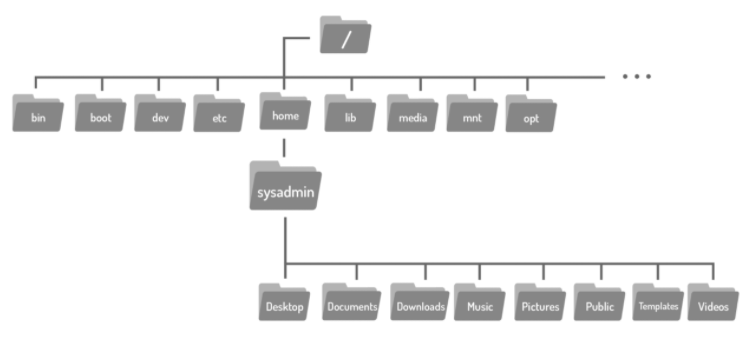

Use o comando ` cd ` para navegar e alterar entre diretórios.

` cd [opcoes…] [argumentos…] `

Os diretórios são equivalentes a pastas no Windows e Mac OS. Assim como esses sistemas operacionais mais populares, uma estrutura de diretórios Linux tem um nível superior. Não é chamado de “Meu Computador”, mas sim o diretório root (raiz) e é representado pelo caractere "/". Para mover para o diretório root, use o caractere "/" como argumento para o comando ` cd `.

O argumento para o comando ` cd ` é mais do que apenas o nome de um diretório, na verdade é um caminho. Um caminho é uma lista de diretórios separados pelo caractere "/".

---
Se você pensar no sistema de arquivos como um mapa, os caminhos são as direções passo a passo; eles podem ser usados para indicar a localização de qualquer arquivo dentro do sistema de arquivos. Existem dois tipos de caminhos: absoluto e relativo. Os caminhos absolutos começam na root do sistema de arquivos, os caminhos relativos começam a partir da sua localização atual.

* Caminho absoluto: Um caminho absoluto permite que você especifique a localização exata de um diretório.
* Caminho relativo: um caminho relativo fornece direções para um arquivo relativo à sua localização atual no sistema de arquivos. Os caminhos relativos não começam com o caractere "/", eles começam com o nome de um diretório.
---

### Atalhos
* Os caracteres "..": Independentemente do diretório em que você esteja, os caracteres ".." sempre representa um diretório maior em relação ao diretório atual, às vezes referido como o diretório pai. Mais resumidamente, os caracteres ".." são usados para voltar um diretório.
* O caractere ".": Independentemente do diretório em que você esteja, o caractere . sempre representa seu diretório atual. Para o ` cd ` este atalho não é muito útil, mas será útil para comandos cobertos nas seções subsequentes.
* O caractere "~": Usado para retornar ao seu diretório home a qualquer momento, execute o seguinte comando: ` cd ~ `.

## Acesso Administrativo
Existem muitos comandos Linux que lidam com informações confidenciais, como senhas, hardware do sistema, ou de outra forma operam sob outras circunstâncias excepcionais. Impedir que usuários regulares executem esses comandos ajuda a proteger o sistema. Fazer login como usuário root fornece acesso administrativo, permitindo a execução de alguns dos comandos privilegiados.

## O comando ` su `

` su [opções] [nome-do-usuário] `

O comando ` su ` permite que você atue temporariamente como um usuário administrador. Ele faz isso criando um novo console de entrada de texto que permite digitar comandos, chamado shell. Para sair e retornar à conta, use o comando ` exit `.

Depois de executar o comando, uma senha é necessária. Você consegue mudar ou definir a senha de algum usuário escrevendo o comando ` password [nome-do-usuário] `.

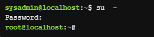

## O comando ` sudo `

` sudo [opções] [comando] `

O comando ` sudo ` permite que você execute um comando como usuário administrador sem criar um novo shell. O comando ` sudo ` também pode ser usado para alternar para outras contas de usuário. Para especificar uma conta de usuário diferente, use a opção ` -u `.

Assim como o comando ` su `, o ` sudo ` também pede senha para entrar no usuário.

Execute o comando ` sl ` como usuário root colocando ` sudo ` na frente dele.

## Permissões 
As permissões determinam as maneiras pelas quais diferentes usuários podem interagir com um arquivo ou diretório.

Vamos usar as informações de um arquivo exemplo para mostrar as informações necessárias:

    -rw-r--r-- 1 sysadmin sysadmin 647 Dec 20  2017 hello.sh

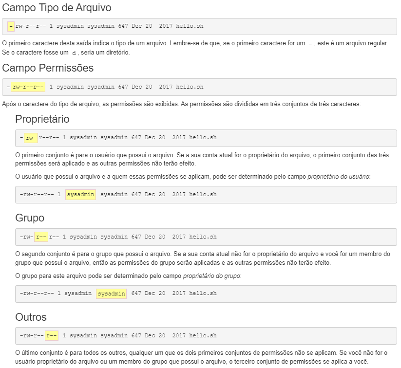

### Tipos de permissão
Existem três permissões diferentes que podem ser colocadas em um arquivo ou diretório: ler, gravar e executar. A maneira pela qual essas permissões se aplicam difere para arquivos e diretórios.

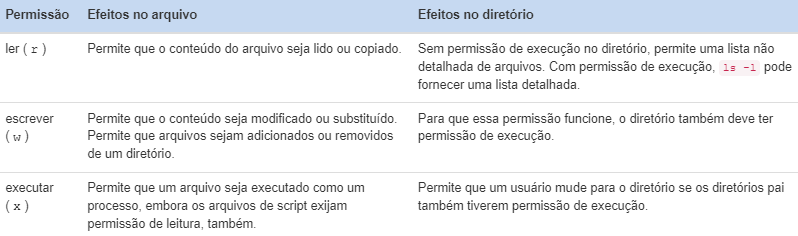

### Alterando Permissões
O comando ` chmod ` é usado para alterar as permissões de um arquivo ou diretório. Somente o usuário administrador (root) ou o usuário que possui o arquivo é capaz de alterar as permissões de um arquivo. Existem duas técnicas para alterar as permissões: Simbólico e Octal. O método simbólico é bom para alterar um conjunto de permissões de cada vez. O método octal ou numérico requer o conhecimento do valor octal de cada uma das permissões e requer que todos os três conjuntos de permissões (usuário, grupo, outros) sejam especificados a cada vez.

Por uma questão de simplicidade, apenas o método simbólico será coberto.
    
    chmod [<conjunto><ação><permissões>]... arquivo
    
Para usar o método simbólico de ` chmod ` você deve, primeiro, indicar qual conjunto de permissões está sendo alterado:

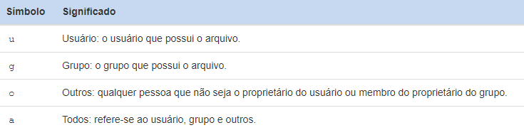

Depois, especifique um símbolo de ação:

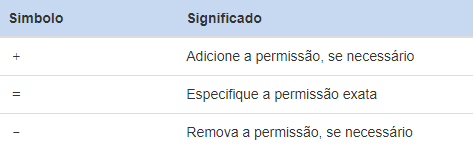

Após um símbolo de ação, especifique uma ou mais permissões a serem executadas:

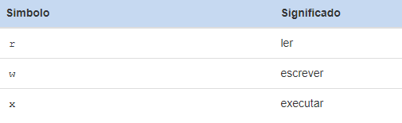

Finalmente, um espaço e os nomes de caminho para os aquivos atribuírem essas permissões. Por exemplo:

    chmod u+x hello.sh

## Alterando a Propriedade
Inicialmente, o proprietário de um arquivo é o usuário que o cria. O comando ` chown ` é usado para alterar a propriedade de arquivos e diretórios. Alterar o proprietário do usuário requer acesso administrativo. Um usuário regular não pode usar esse comando para alterar o proprietário do usuário de um arquivo, mesmo para dar a propriedade de um de seus próprios arquivos a outro usuário. No entanto, o comando ` chown ` também permite alterar a propriedade do grupo, o que pode ser feito pela root ou o proprietário do arquivo.

Para alterar o propietário do usuário de um arquivo use a seguinte sintaxe:

    chown [opções] [proprietário] arquivo

O primeiro argumento, "proprietário", especifica qual usuário deve ser o novo proprietário. O segundo argumento, "arquivo", especifica qual arquivo está mudando a propriedade.

Não se esqueça de usar o comando ` sudo ` para obter os privilégios de administrador, se não você não conseguirá alterar a propriedade de um arquivo ou diretório.

## Exibindo Arquivos
Existem alguns comandos Linux disponíveis para visualizar o conteúdo dos arquivos. O comando ` cat `, que significa "concatenate", é frequentemente usado para visualizar rapidamente o conteúdo de pequenos arquivos.

O comando cat exibirá todo o conteúdo do arquivo, por isso é recomendado principalmente para arquivos menores onde a saída é limitada e não requer rolagem.

    cat [opções] [arquivo]

Ao visualizar arquivos maiores, o comando ` cat ` pode resultar em uma saída muito longa que não pode ser pausada para rolar. Um melhor método de visualização de arquivos de texto longos é com um comando de pager. Alguns exemplos são: ` more ` ou ` less `.

Outra maneira de visualizar o conteúdo dos arquivos é usando os comandos ` head ` e ` tail `. Esses comandos são usados para exibir um número selecionado de linhas na parte superior ou inferior de um arquivo.

    head [opções] [arquivo]
    tail [opções] [arquivo]

A opção ` -n ` com os comandos ` head ` e ` tail ` pode ser usada para especificar a quantidade de linhas a serem exibidas. Para usar a opção ` -n `, especifique a quantidade de linhas do arquivo que deseja exibir após a opção e use o nome do arquivo como argumento.

    head -n [número de linhas] [nome do arquivo]

## Copiando Arquivos
O comando ` cp ` é usado para copiar arquivos. Ele requer pelo menos dois argumentos: uma origem e um destino.

    cp [opções] fonte destino

As permissões podem ter um impacto nos comandos de gerenciamento de arquivos, como o comando ` cp `. Para copiar um arquivo, é necessário ter permissão de execução para acessar o diretório onde o arquivo está localizado e a permissão de leitura para o arquivo que está sendo copiado. Também é necessário ter permissão de gravação e execução no diretório para o qual o arquivo está sendo copiado.

Criar cópias de arquivos pode ser útil por vários motivos:
* Se uma cópia de um arquivo for criada antes que as alterações sejam feitas, é possível voltar ao original.
* Uma cópia de um arquivo pode ser usada para transferir um arquivo para dispositivos de mídia removíveis.
* Uma cópia de um documento existente pode ser usada como modelo para um novo documento.
---
O comando ` dd ` é um utilitário para copiar arquivos ou partições inteiras no nível de bits.

    dd [opções] operando

Este comando tem vários recursos úteis, inclusive:
* Pode ser usado para clonar ou excluir (limpar) discos ou partições inteiros.
* Pode ser usado para copiar dados brutos para dispositivos removíveis, como unidades USB e CDROMs.
* Pode fazer backup e restaurar o MBR (Master Boot Record).
* Pode ser usado para criar um arquivo de tamanho específico preenchido com zeros binários, que pode ser usado como um arquivo de swap (memória virtual).

O comando ` dd ` usa argumentos especiais para especificar como ele funcionará. A seguir ilustra alguns dos argumentos mais comumente usados:

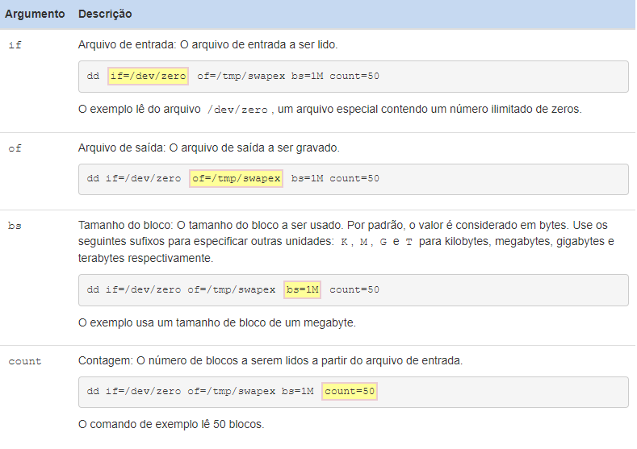

## Mover Arquivos
O comando ` mv ` é usado para mover um arquivo de um local no sistema de arquivos para outro.

    mv fonte destino

O comando ` mv ` requer pelo menos dois argumentos. O primeiro argumento é a fonte, um caminho para o arquivo a ser movido. O segundo argumento é o destino, um caminho para onde o arquivo será movido. Os arquivos a serem movidos às vezes são chamados de origem, e o local onde os arquivos devem ser colocados é chamado de destino.

Se um arquivo for movido de um diretório para outro sem especificar um novo nome para o arquivo, ele manterá seu nome original. Mover um arquivo dentro do mesmo diretório é uma maneira eficaz de renomeá-lo.

O comando ` mv ` é capaz de mover vários arquivos, desde que o argumento final fornecido ao comando seja o destino.

As permissões podem ter um impacto nos comandos de gerenciamento de arquivos, como o comando ` mv `. Mover um arquivo requer permissões de gravação e execução tanto nos diretórios de origem quanto nos de destino.

## Removendo Arquivos
O comando ` rm ` é usado para excluir arquivos e diretórios. É importante ter em mente que arquivos e diretórios excluídos não entram em uma "lixeira" como acontece com sistemas operacionais voltados para área de trabalho. Quando um arquivo é excluído com o comando ` rm `, ele quase sempre desaparece permanentemente.

    rm [opções] arquivo

Sem opções, o comando ` rm ` é normalmente usado para remover arquivos regulares. O comando ` rm ` ignorará os diretórios que é solicitado a remover; para excluir um diretório, use uma opção recursiva, seja as opções ` -r ` ou ` -R `. Basta ter cuidado, uma vez que estas opções são “recursivas”, isto irá eliminar todos os arquivos e todos os subdiretórios.

As permissões podem ter um impacto nos comandos de gerenciamento de arquivos, como o comando ` rm `. Para excluir um arquivo dentro de um diretório, um usuário deve ter permissão de gravação e execução em um diretório. Normalmente, os usuários regulares só têm esse tipo de permissão em seu diretório (home) pessoal e seus subdiretórios.

## Filtragem de Entrada
O comando ` ` grep ` ` é um filtro de texto que irá procurar linhas de entrada e retorno que contenham uma correspondência para um determinado padrão.

    ` grep ` [opções] padrão [arquivo]

O comando ` ` grep ` ` pode ser usado para filtrar informações sobre um usuário específico, apenas use o nome de usuário como argumento de padrão e o arquivo como argumento de arquivo. O comando ` ` grep ` ` é capaz de interpretar padrões de pesquisa complexos.

### Expressões Regulares
As expressões regulares têm duas formas comuns: básica e estendida. A maioria dos comandos que usam expressões regulares pode interpretar expressões regulares básicas. No entanto, expressões regulares estendidas não estão disponíveis para todos os comandos e uma opção de comando é normalmente necessária para que eles funcionem corretamente.

A tabela a seguir resume os caracteres básicos de expressão regular:

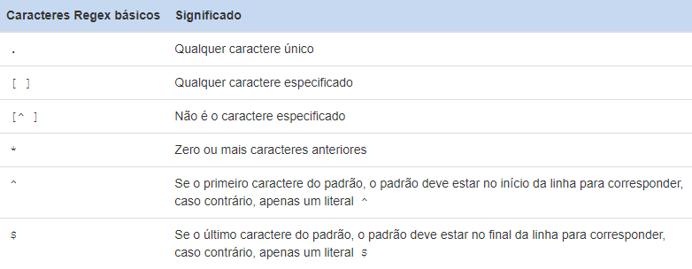

A tabela a seguir resume as expressões regulares estendidas, que devem ser usadas com o comando ` e` grep ` ` ou a opção ` -E ` com o comando ` ` grep ` `:

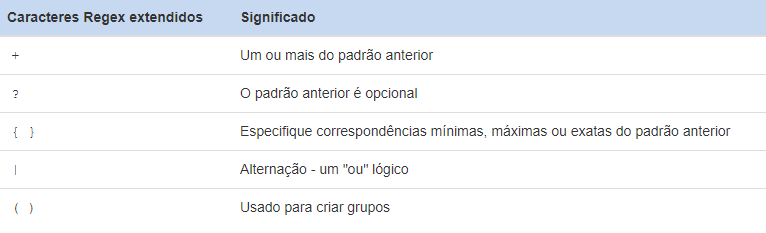

### Padrões Básicos
Expressões regulares são padrões que apenas certos comandos são capazes de interpretar. Expressões regulares podem ser expandidas para corresponder a determinadas sequências de caracteres no texto. Os exemplos exibidos nesta página farão uso de expressões regulares para demonstrar seu poder quando usado com o comando ` ` grep ` `.

* Caracteres Ancora

Caracteres âncora são uma das formas como expressões regulares podem ser usadas para restringir os resultados da pesquisa.

Para evitar que o shell os interprete errôneamente como caracteres especiais, esses padrões devem ser protegidos por aspas fortes, o que significa simplesmente colocá-los entre aspas simples. 

O primeiro caractere âncora ^ é usado para garantir que um padrão apareça no início da linha. Observe que ^ deve ser o primeiro caractere no padrão para ser efetivo.

O segundo caractere âncora $ pode ser usado para garantir que um padrão apareça no final da linha, reduzindo assim efetivamente os resultados da pesquisa. Para encontrar as linhas que terminam com um "r" em um arquivo qualquer, use o padrão ` r$ `.

Novamente, a posição deste caractere é importante, o $ deve ser o último caractere no padrão para ser eficaz como uma âncora.

* Caractere ` . `

Uma das expressões mais úteis é o caractere de ponto ` . `. Ele irá corresponder a qualquer caractere, exceto para o novo caractere de linha. O mesmo conceito pode ser repetido usando outras combinações. Este caractere pode ser usado qualquer número de vezes.

* Caractere ` [] `

Os colchetes ` [] ` correspondem a um único caractere da lista ou intervalo de caracteres possíveis contidos entre parênteses.

Para encontrar todas as linhas em um arquivo qualquer que têm um número neles, use o padrão ` [0123456789] ` ou ` [0-9] `.

Por outro lado, para encontrar todas as linhas que contêm caracteres não numéricos, insira um ^ como o primeiro caractere dentro dos colchetes. Este caractere nega os caracteres listados.

Quando outros caracteres de expressão regular são colocados dentro de colchetes, eles são tratados como caracteres literais. Por exemplo, o ` . ` normalmente corresponde a qualquer caractere, mas colocado dentro dos colchetes, então ele irá apenas corresponder a si mesmo.

* Caractere ` * `

O caractere de expressão regular ` * ` é usado para corresponder zero ou mais ocorrências de um caractere ou padrão que o precede.

Também é possível combinar zero ou mais ocorrências de uma lista de caracteres utilizando os colchetes. O padrão ` [oe]* ` corresponderá a zero ou mais ocorrências do caractere "o" ou do caractere "e".

Quando usado com apenas um outro caractere, ` * ` não é muito útil.

Isso ocorre porque ` * ` pode corresponder a zero ocorrências de um padrão. Para tornar o ` * ` útil, é necessário criar um padrão que inclua mais do que apenas um caractere precedente a ` * `.

### Entrada Padrão
Se um nome de arquivo não for fornecido, o comando ` grep ` será lido a partir de entrada padrão, que normalmente vem do teclado com entrada fornecida pelo usuário que executa o comando. Isso fornece uma experiência interativa com ` grep ` onde o usuário digita na entrada e os filtros do ` grep ` à medida que vai.

## Desligando
O comando ` shutdown ` faz com que o sistema seja desligado de forma segura. Todos os usuários conectados são notificados de que o sistema está sendo desativado e, nos últimos cinco minutos que antecederam o desligamento, novos logins são evitados.

    shutdown [opções] tempo [mensagem]

O comando ` shutdown ` requer acesso administrativo. Ao contrário de outros comandos usados para desligar o sistema, o comando ` shutdown ` requer um argumento de tempo especificando quando o desligamento deve começar. Os formatos deste argumento de tempo podem ser a palavra now (agora), uma hora do dia no formato hh:mm ou o número de minutos para atrasar no formato +minutos.

O relógio do nosso sistema pode ser definido para um fuso horário diferente daquele em que você está localizado. Para verificar a hora no terminal, use o comando ` date `.

O comando ` shutdown ` também tem um argumento de mensagem opcional, indicando uma mensagem que aparecerá nos terminais de todos os usuários.

## Configuração de Rede
O comando ` ifconfig ` significa “configuração de interface” e é usado para exibir informações sobre a configuração de rede.

    ifconfig [opções]

O comando ` iwconfig ` é semelhante ao comando ` ifconfig `, mas é dedicado a interfaces de rede sem fio.

O comando ` ifconfig ` também pode ser usado para modificar temporariamente as configurações de rede. Normalmente, essas alterações devem ser permanentes, portanto, usar o comando ` ifconfig ` para fazer essas alterações é bastante raro.

O comando ` ping ` é usado para verificar a conectividade entre dois computadores. Ele faz isso enviando pacotes para outra máquina em uma rede. Se o remetente receber uma resposta, deverá ser possível conectar-se a essa máquina.

As informações são enviadas usando 'pacotes'; a unidade encapsulada de dados enviados através de uma rede. Para que os pacotes encontrem o outro computador, eles precisarão de um endereço. O comando ` ping ` usa endereços IP para identificar um computador na rede ao qual ele deseja se conectar.

Por padrão, o comando ` ping ` continuará enviando pacotes até que o comando break (CTL-C) seja inserido no console. Para limitar quantos pings são enviados, use a opção `- c ` seguida do número de pings a serem enviados.

Se o comando ` ping ` falhar, você receberá uma mensagem informando: Destination Host Unreachable (Host de destino inacessível).

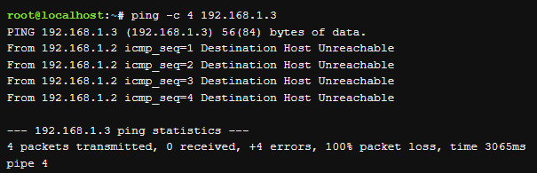

O comando ` ping ` pode falhar mesmo que a máquina remota esteja se conectando. Isso ocorre porque alguns administradores configuram suas máquinas, ou mesmo redes inteiras, para não responder a solicitações de ` ping ` como medida de segurança. O comando ` ping ` também funciona com um nome de host ou nome de domínio, como yahoo.com. Usando este primeiro, se o comando ` ping ` for bem sucedido, haverá uma resolução apropriada do nome e o endereço IP também estará funcionando corretamente.

## Exibindo Processos
A execução de um comando resulta em algo chamado processo. No sistema operacional Linux, os processos são executados com os privilégios do usuário que executa o comando. Isso permite que os processos sejam limitados a determinados recursos com base na identidade do usuário.

Embora existam exceções, geralmente o sistema operacional diferenciará os usuários com base no fato de serem eles, ou não, o administrador. Normalmente, os usuários regulares não podem controlar os processos de outro usuário. Os usuários que têm privilégios administrativos podem controlar qualquer processo do usuário, inclusive a interrupção de qualquer processo de usuário.

O comando ` ps ` pode ser usado para listar processos.

    ps [opções]

O comando ` ps ` exibirá os processos que estão sendo executados no terminal atual por padrão. A saída inclui as seguintes colunas de informações:
* PID: O identificador do processo, que é exclusivo para o processo. Esta informação é útil para controlar o processo pelo seu número de identificação.
* TTY: O nome do terminal em que o processo está sendo executado. Esta informação é útil para distinguir entre diferentes processos que têm o mesmo nome.
* TIME: A quantidade total de tempo do processador usado pelo processo. Normalmente, essas informações não são usadas por usuários comuns.
* CMD: O comando que iniciou o processo.

Em vez de visualizar apenas os processos em execução no terminal atual, os usuários podem querer visualizar todos os processos em execução no sistema. A opção ` -e ` exibirá todos os processos.

Normalmente, a opção ` -f ` também é usada, pois fornece mais detalhes na saída do comando, incluindo opções e argumentos.

## Gerenciamento de Pacotes
O gerenciamento de pacotes é um sistema pelo qual o software pode ser instalado, atualizado, consultado ou removido de um sistema de arquivos. No Linux, existem muitos sistemas diferentes de gerenciamento de pacotes de software diferentes, mas os dois mais populares são os do Debian e da Red Hat.

No nível mais baixo do sistema de gerenciamento de pacotes Debian está o comando ` dpkg `. Este comando pode ser complicado para usuários iniciantes do Linux, então a Advanced Package Tool, ` apt-get `, um programa front-end para a ferramenta ` dpkg `, torna o gerenciamento de pacotes ainda mais fácil.

Muitos dos comandos de gerenciamento de pacotes exigem acesso administrativo.
* Os comandos de pacotes, geralmente, podem levar alguns minutos para serem executados.

### Instalando Pacotes
Os arquivos de pacote são normalmente instalados baixando-os diretamente de repositórios localizados em servidores de Internet. Os repositórios Debian contêm mais de 65.000 pacotes diferentes de software. Antes de instalar um pacote, é uma boa prática usar a atualização da lista de pacotes disponíveis usando o comando ` apt-get update `.

    sudo apt-get update

Para procurar palavras-chave dentro desses pacotes, você pode usar o comando ` apt-cache search `.

    apt-cache search [palavra chave]

A palavra-chave usada deve corresponder a parte do nome ou descrição do pacote que deve ser localizado. Várias palavras-chave podem ser usadas para esclarecer ainda mais a pesquisa.

Depois de encontrar o pacote que deseja instalar, você pode instalá-lo com o comando ` apt-get install `.

    sudo apt-get install [pacote]

### Atualizando Pacotes
O comando ` apt-get install ` pode atualizar um pacote, se esse pacote estiver instalado e uma versão mais recente estiver disponível. Se o pacote ainda não estiver no sistema, ele será instalado; se estiver no sistema, ele será atualizado.

A atualização de todos os pacotes do sistema deve ser feita em duas etapas. Primeiro, atualize o cache de todos os pacotes disponíveis com o apt-get update. Em segundo lugar, execute o comando apt-get upgrade e todos os pacotes e dependências serão atualizados.

    apt-get update 
    apt-get upgrade

### Removendo Pacotes
Um administrador pode executar o comando ` apt-get remove ` para remover um pacote ou o comando ` apt-get purge ` para limpar um pacote completamente do sistema.

O comando ` apt-get ` é capaz de remover ou limpar um pacote. A diferença entre os dois é que a limpeza apaga todos os arquivos de pacote, enquanto a remoção exclui todos os arquivos de configuração do pacote, exceto os arquivos de configuração.

    apt-get remove [pacote]
    apt-get purge [pacote]

## Atualizando Senhas de Usuário
O comando ` passwd ` é usado para atualizar a senha de um usuário. Os usuários só podem alterar suas próprias senhas, enquanto o usuário root pode atualizar a senha para qualquer usuário.

    passwd [opções] [utilizador]

Por razões de segurança, nenhuma saída é exibida enquanto o comando está sendo executado. Se o usuário quiser exibir informações de status sobre sua senha, ele pode usar a opção ` -S `. 

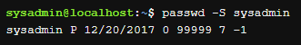

Os campos de saída são explicados abaixo:

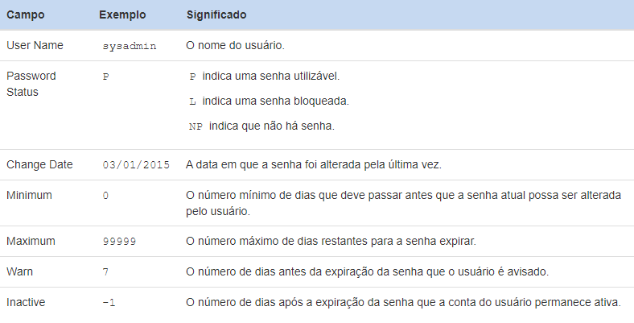

## Redirecionamento
Adicionar conteúdo a arquivos no Linux pode ser feito de várias maneiras. Linux tem alguns editores de texto que podem ser usados para adicionar conteúdo a um arquivo. No entanto, esse método requer alguma familiaridade com os comandos do editor de texto do Linux.

Há uma maneira no Linux de adicionar rapidamente conteúdo a um arquivo usando um recurso de linha de comando chamado de redirecionamento de entrada/saída (I/O). O redirecionamento de I/O permite que as informações na linha de comando sejam enviadas para arquivos, dispositivos e outros comandos. A entrada ou saída de um comando é redirecionada de seu destino padrão para um local diferente. O redirecionamento de I/O é como uma série de trilhos de trem, onde um switch (interruptor) pode ser habilitado para direcionar a saída de um comando em uma faixa diferente para que ele vá para outro lugar no shell.

Quando se trata de entrada de comando e saída existem três caminhos, ou 'trilhas'. Esses caminhos são chamados de descritores de arquivo. O primeiro descritor de arquivo é entrada padrão (standard input), abreviado como STDIN. A entrada padrão é a informação que o comando recebe e processa quando é executado, essencialmente o que um usuário digita no teclado. O segundo descritor de arquivo é a saída padrão (standard output), abreviado como STDOUT. Saída padrão é a informação que o comando exibe, a saída do comando. O último descritor de arquivo é erro padrão (standard error), abreviado como STDERR. STDERR, são as mensagens de erro geradas por comandos que não são executados corretamente. Veja a seguir exemplos de como os descritores de arquivos aparecerão no terminal:

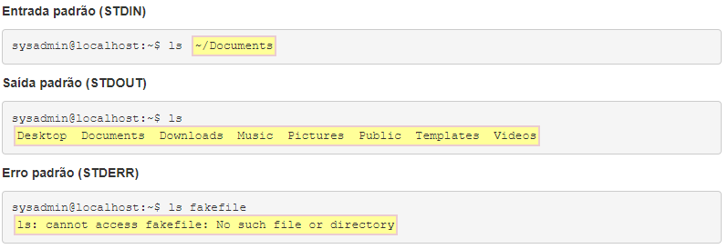

Esta seção abordará um dos três descritores de arquivos, STDOUT, e como redirecionar STDOUT de onde você normalmente o vê, no terminal, para um arquivo no sistema de arquivos. Para usar o redirecionamento, basta usar um símbolo maior do que > junto com um nome de arquivo.

    [comando] > [arquivo]

Você pode usar o comando ` cat ` para redirecionar o STDOUT. Por exemplo:

    cat food.txt > newfile1.txt

Isso é útil se você precisar copiar conteúdo de um arquivo importante para outro arquivo para editar o conteúdo sem modificar o arquivo original. No entanto, e se você quiser adicionar um comentário ou nota a um arquivo? Para fazer isso, você pode usar o comando ` echo `. O comando ` echo ` é usado para imprimir a saída no terminal.

Imprimir comentários na tela é um recurso divertido, mas o comando echo pode ser mais útil usando o redirecionamento. Usando o comando ` echo `, o conteúdo pode ser adicionado ao arquivo que você deseja.

O comando ` echo ` substitui o conteúdo original do arquivo. Isso ocorre porque o único caractere ">" substituirá qualquer conteúdo em um arquivo existente. Para anexar em vez de sobrescrever/substituir conteúdo a um arquivo, use um símbolo duplo maior do que ">>".

## Editor de Texto
O principal editor de texto para Linux e UNIX é um programa chamado ` vi `. Embora existam inúmeros editores disponíveis para Linux que vão desde o pequeno editor ` nano ` até o enorme editor ` emacs `, existem várias vantagens para o editor ` vi `:

* O editor ` vi ` está disponível em todas as distribuições Linux do mundo. Isto não é verdade para qualquer outro editor.

* O editor ` vi ` pode ser executado tanto em uma CLI (interface de linha de comando) quanto em uma GUI (interface gráfica do usuário).

* Embora novos recursos tenham sido adicionados ao editor ` vi `, as funções principais já existem há décadas. Isso significa que se alguém aprendeu o editor ` vi ` na década de 1970, eles poderiam usar uma versão moderna sem qualquer problema. Embora pareça trivial, pode não parecer tão trivial daqui a 20 anos.

Na realidade, a maioria dos sistemas Linux não inclui o ` vi ` original, mas uma versão melhorada do mesmo conhecido como ` vim `, para ` vi ` melhorado. Este fato pode estar oculto pela maioria das distribuições Linux. Na maioria das vezes, o ` vim ` funciona como ` vi `, mas tem recursos adicionais. Para os tópicos que serão abordados neste curso, tanto ` vi ` como ` vim ` funcionarão.

Para começar a usar ` vi `, basta digitar o comando seguido do nome do caminho para o arquivo para editar ou criar. Exemplo:

### Pesquisando em vi
Outra função padrão que os processadores de texto oferecem é o encontrar. Muitas vezes, as pessoas usam CTRL-F ou observam o menu de edição. O programa ` vi ` usa a pesquisa. O pesquisar é mais eficiente do que o encontrar porque suporta padrões de texto literal e expressões regulares.

Para pesquisar a partir da posição atual do cursor, use ` / ` para iniciar a pesquisa, digite um termo de pesquisa e pressione a tecla Enter para iniciar a pesquisa. O cursor se moverá para a primeira correspondência que for encontrada.

Para prosseguir para a próxima correspondência usando o mesmo padrão, pressione a tecla ` n `. Para voltar a uma partida anterior, pressione a tecla ` N `. Se o fim ou o início do documento for atingido, a pesquisa se estenderá automaticamente para o outro lado do documento.

Para começar a pesquisar para trás a partir da posição do cursor, comece escrevendo ` ? `, depois digite o padrão para procurar correspondências e pressione a tecla Enter.

Existem três modos de usar o ` vi `: modo de comando, modo de inserção e modo ex.

### Modo de Comando
#### Movimento do Modo de Comando

Inicialmente, o programa é iniciado no modo de comando. Modo de comando é usado para digitar comandos, como aqueles usados para se mover em torno de um documento, manipular texto e acessar os outros dois modos. Para retornar ao modo de comando a qualquer momento, pressione a tecla Esc.

Uma vez que algum texto foi adicionado a um documento, para executar ações como mover o cursor, a tecla Esc precisa ser pressionada primeiro para retornar ao modo de comando. Isso parece muito trabalho, mas lembre-se que ` vi ` funciona em um ambiente terminal onde um mouse é inútil.

Comandos de movimento em ` vi ` têm dois aspectos, um movimento e um prefixo numérico opcional, que indica quantas vezes repetir esse movimento. O formato geral é o seguinte:

    [contagem] movimento

A seguir temos uma tabela que resume as teclas de movimento disponíveis:

Esses movimentos podem ser prefixados com um número para indicar quantas vezes o movimento deve ser realizado. Por exemplo, ` 5h ` moverá o cursor cinco caracteres para a esquerda e ` 3w ` moverá o cursor três palavras para a direita.

Para mover o cursor para um número de linha específico, digite esse número de linha seguido do caractere ` G `. Por exemplo, para chegar à quinta linha do arquivo tipo ` 5G `. ` 1G ` ou gg pode ser usado para ir para a primeira linha do arquivo, enquanto um ` G ` solitário irá levá-lo para a última linha. Para descobrir em que linha o cursor está atualmente, use CTRL-G.

#### Ações do Modo de Comando
A convenção padrão para edição de conteúdo com processadores de texto é usar copiar, cortar e colar. O programa vi não tem nenhum destes. Em vez disso, ` vi ` usa os três comandos a seguir:

Os comandos da explicação anterior são usados para especificar onde a ação deve ocorrer, sempre começando com a localização atual do cursor.

    ação [contagem] movimento
    [contagem] movimento ação

##### Excluir
Excluir remove o texto indicado da página e o guarda no buffer, sendo o buffer o equivalente à “área de transferência” usada no Windows ou Mac OSX. A tabela a seguir fornece alguns exemplos de uso comuns:

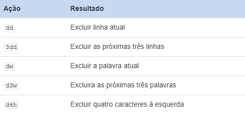

##### Mudar
Mudança é muito semelhante a excluir; o texto é removido e guardado no buffer, no entanto, o programa é alternado para o modo de inserção para permitir alterações imediatas no texto. A tabela a seguir fornece alguns exemplos de uso comuns:

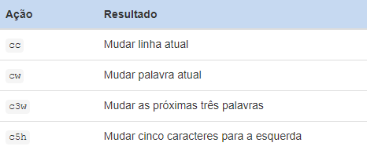

##### Arrancar (Yank)
Yank coloca conteúdo no buffer sem excluí-lo. A tabela a seguir fornece alguns exemplos de uso comuns:

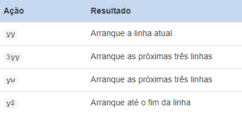

##### Colocar
O colocar, posiciona o texto guardado no buffer antes ou depois da posição do cursor. Observe que estas são as duas únicas opções, o colocar não usa os movimentos como os comandos de ação anteriores.

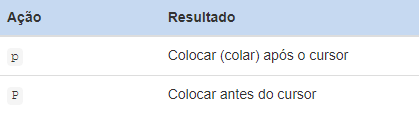

### Modo de Inserção
O modo de inserção é usado para adicionar texto ao documento. Há algumas maneiras de entrar no modo de inserção a partir do modo de comando, cada uma diferenciada por onde a inserção de texto começará. A tabela a seguir abrange o mais comum:

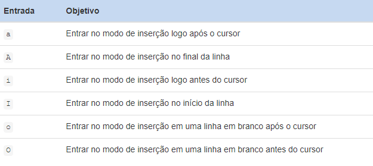

### Ex Mode
Originalmente, o editor ` vi ` era chamado de editorex. O nome ` vi ` era a abreviação do comando visual no editor ` ex ` que mudou o editor para o modo “visual”.

No modo normal original, o editor ` ex ` só permitia aos usuários ver e modificar uma linha de cada vez. No modo visual, os usuários podiam ver o máximo possível do documento que caberia na tela. Como a maioria dos usuários preferia o modo visual ao modo de edição de linha, o arquivo ` ex ` programa foi vinculado a um arquivo ` vi `, para que os usuários pudessem iniciar ` ex ` diretamente no modo visual quando executassem o link ` vi `.

Eventualmente, o arquivo de programa real foi renomeado ` vi ` e o editor ` ex ` tornou-se um link que apontava o editor ` vi `.

Quando o modo ` ex ` do editor ` vi ` está sendo usado, é possível visualizar ou alterar configurações, bem como executar comandos relacionados a arquivos, como abrir, guardar ou interromper alterações em um arquivo. Para chegar ao modo ` ex `, digite um caractere ` : ` no modo de comando. A tabela a seguir lista algumas ações comuns executadas no modo ex:

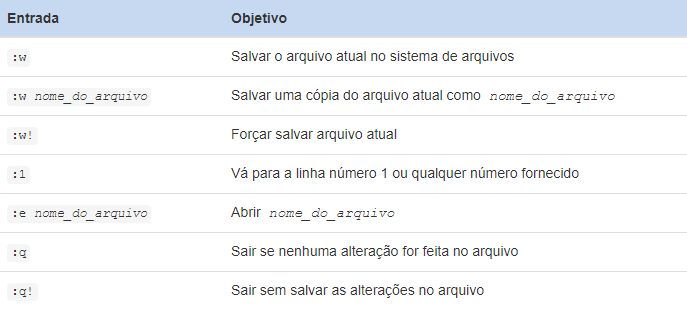

Uma análise rápida da tabela acima revela que, se um ponto de exclamação, ` ! `, é adicionado a um comando, ele então tenta forçar a operação. Por exemplo, imagine que você faz alterações em um arquivo no editor ` vi ` e, em seguida, tente sair com ` :q `, apenas para descobrir que o comando falha. O editor ` vi ` não quer sair sem salvar as alterações feitas em um arquivo, mas você pode forçá-lo a sair com o comando ex ` :q! `.